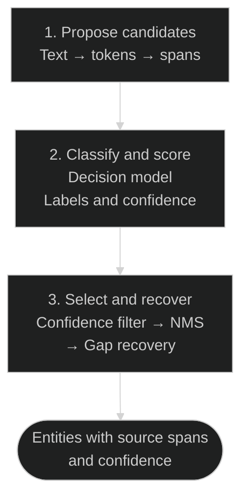

<p align="center">
  
</p>
<h1 align="center">decision-entity-extractor</h1>
<p align="center">Extract the entities you define, with their exact place in the text.</p>
<p align="center">
  <a href="pyproject.toml"></a>
  <a href="config/schema.example.json"></a>
  <a href="LICENSE"></a>
</p>
<p align="center">English · <a href="README.zh-TW.md">繁體中文</a></p>

## Text in, entities out

```text
Alice works at Acme in Taipei.
```

Illustrative extraction with the example schema:

| Mention | Label | Character span |
| --- | --- | --- |
| Alice | PERSON | `[0, 5)` |
| Acme | ORGANIZATION | `[15, 19)` |
| Taipei | PLACE | `[23, 29)` |

Each result includes confidence scores and source evidence. Spans refer to the
original text; the tool does not map mentions to catalog IDs.

## Features

- Define entity types with your own names and descriptions.
- Extract candidate spans, then classify them with a decision model.
- Filter by confidence, suppress contained spans with NMS, and recover missed spans in gaps.
- Use the same resolver through the CLI, Python, or HTTP.

## Quick start

- Python 3.12 or 3.13 and [uv](https://docs.astral.sh/uv/getting-started/installation/).
- Linux or Windows for the locked CPU setup; macOS has no pinned PyTorch wheel.
- About 3.14 GB of model weights, plus disk space for cache and staging.
- A `TYPESAFE_API_KEY` for the bundled decision provider.

### 1. Install

```bash
git clone https://github.com/Gratia2533/decision-entity-extractor.git
cd decision-entity-extractor
uv venv --python 3.13
uv sync --frozen --extra otter --extra decision --extra api
```

### 2. Download and verify models

```bash
uv run --no-sync entity-resolver download --artifact-root .local-artifacts
uv run --no-sync entity-resolver check --artifact-root .local-artifacts
```

### 3. Extract entities

Set the key in your shell (`export` below is for Bash/Zsh; see
[PowerShell setup](docs/usage.md#environment)), then run:

```bash
export TYPESAFE_API_KEY="your-api-key"
uv run --no-sync entity-resolver resolve \
  --artifact-root .local-artifacts \
  --schema config/schema.example.json \
  --text "Alice works at Acme in Taipei."
```

- Edit [the example schema](config/schema.example.json) to change entity types.
- Output is JSON. See [Python and HTTP usage](docs/usage.md) for integration examples.
- Models must be downloaded explicitly; `.env` files are not loaded automatically.
- The bundled decision provider sends input text and candidate context to TypeSafe.

## How it works



- Your schema guides candidate extraction and classification.
- NMS suppresses same-label contained spans. Gap recovery reuses existing scores,
  applies a lower threshold, and runs NMS again without another model call.

## Documentation

| Guide | Contents |
| --- | --- |
| [Usage](docs/usage.md) | Environment, model files, Python, HTTP, output fields, troubleshooting |
| [Customization](docs/customization.md) | Entity schema, selection rules, limits, adapters, developer checks |

Model identities and checksums live in [model_specs.py](model_specs.py);
dependency versions live in [pyproject.toml](pyproject.toml) and [uv.lock](uv.lock).
