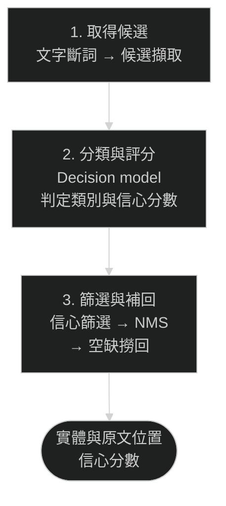

<p align="center">
  
</p>
<h1 align="center">Decision Entity Extractor</h1>
<p align="center">擷取你定義的實體，保留它在原文中的位置。</p>
<p align="center">
  <a href="pyproject.toml"></a>
  <a href="config/schema.example.json"></a>
  <a href="LICENSE"></a>
</p>
<p align="center"><a href="README.md">English</a> · 繁體中文</p>

## 輸入文字，取得實體

```text
Alice works at Acme in Taipei.
```

使用範例 schema 的擷取示意：

| 原文片段 | 類別 | 字元區間 |
| --- | --- | --- |
| Alice | PERSON | `[0, 5)` |
| Acme | ORGANIZATION | `[15, 19)` |
| Taipei | PLACE | `[23, 29)` |

每筆結果包含信心分數與來源證據。區間對應原始文字；工具不會將片段對應到資料目錄中的 ID。

## 特色

- 以自訂名稱與描述定義實體類別。
- 先擷取候選片段，再由 decision model 分類。
- 依信心分數篩選，以非極大值抑制（Non-Maximum Suppression，NMS）抑制包含片段，再從空缺撈回候選。
- 透過 CLI、Python 或 HTTP 使用同一套 resolver。

## 快速開始

- Python 3.12 或 3.13，以及 [uv](https://docs.astral.sh/uv/getting-started/installation/)。
- Linux 或 Windows 的固定 CPU 環境；macOS 尚未設定固定版本的 PyTorch wheel。
- 約 3.14 GB 的模型權重空間，快取與下載暫存另計。
- 內建決策服務使用的 `TYPESAFE_API_KEY`。

### 1. 安裝

```bash
git clone https://github.com/Gratia2533/decision-entity-extractor.git
cd decision-entity-extractor
uv venv --python 3.13
uv sync --frozen --extra otter --extra decision --extra api
```

### 2. 下載並驗證模型

```bash
uv run --no-sync entity-resolver download --artifact-root .local-artifacts
uv run --no-sync entity-resolver check --artifact-root .local-artifacts
```

### 3. 擷取實體

先在 shell 設定金鑰，再執行指令。以下 `export` 適用於 Bash／Zsh；
PowerShell 請參考[環境設定](docs/usage.zh-TW.md#environment)。

```bash
export TYPESAFE_API_KEY="your-api-key"
uv run --no-sync entity-resolver resolve \
  --artifact-root .local-artifacts \
  --schema config/schema.example.json \
  --text "Alice works at Acme in Taipei."
```

- 修改[範例 schema](config/schema.example.json) 即可調整實體類別。
- 結果以 JSON 輸出；整合方式請見 [Python 與 HTTP 用法](docs/usage.zh-TW.md)。
- 模型需手動執行下載指令；程式不會自動讀取 `.env`。
- 內建決策服務會將輸入文字與候選上下文傳送至 TypeSafe。

## 運作流程



- 自訂 schema 用來引導候選擷取與分類。
- NMS 抑制同類別的包含片段。空缺撈回沿用已有分數，以較低門檻選回候選後再次套用 NMS，不額外呼叫模型。

門檻與同分處理方式請見[篩選與撈回規則](docs/customization.zh-TW.md#篩選與撈回)；
內建候選模型請見[模型檔案](docs/usage.zh-TW.md#模型檔案)。

## 延伸文件

| 文件 | 內容 |
| --- | --- |
| [使用指南](docs/usage.zh-TW.md) | 環境、模型檔案、Python、HTTP、輸出欄位、問題排查 |
| [客製化指南](docs/customization.zh-TW.md) | 實體類別、篩選規則、限制、模型介面、開發檢查 |

模型識別資訊與雜湊請見 [model_specs.py](model_specs.py)；
依賴版本請見 [pyproject.toml](pyproject.toml) 與 [uv.lock](uv.lock)。
